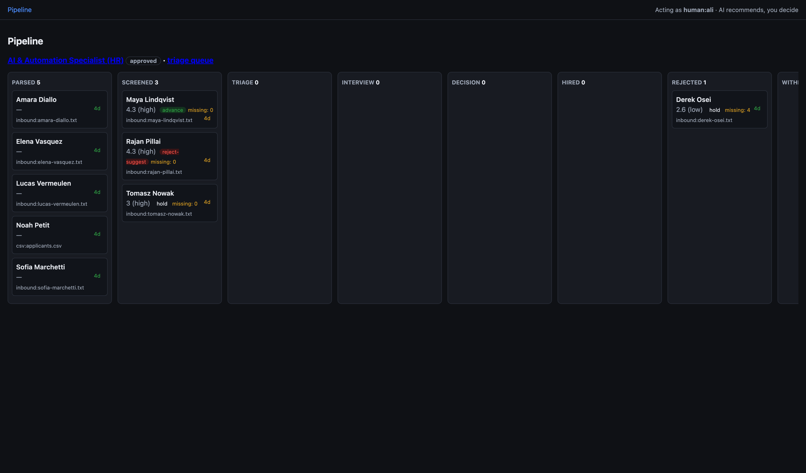
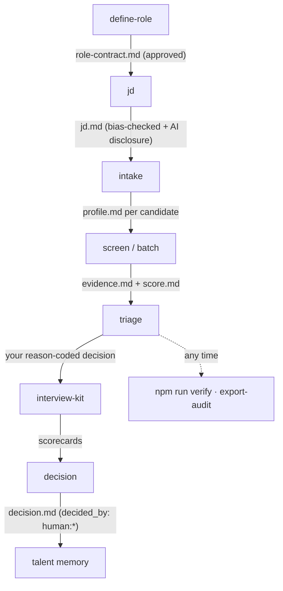
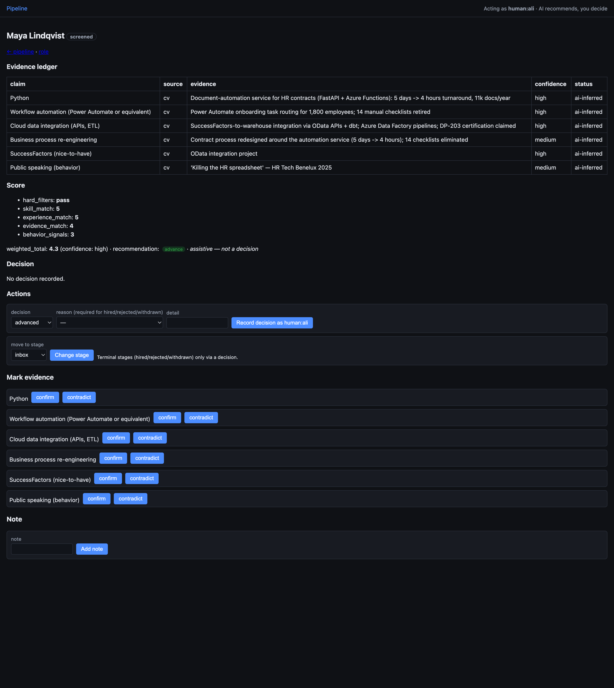
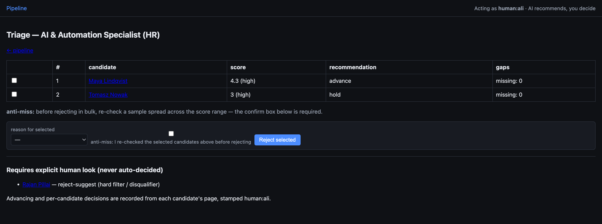
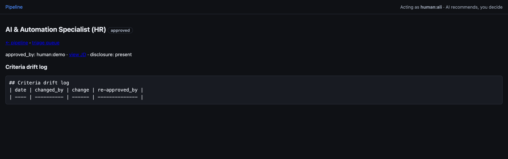

# Talent-Ops

[](https://github.com/shenmali/talent-ops/actions/workflows/ci.yml)
[](LICENSE)

**Evidence-based hiring operating system for AI coding CLIs.**
The employer-side mirror of [career-ops](https://github.com/santifer/career-ops):
candidates got AI to choose companies — this gives hiring teams AI to
choose candidates *on evidence, not keywords*.

> Resume != Candidate. AI recommends, humans decide. Every decision has a
> reason code. Git history is your audit trail.

<p align="center">
  
</p>

<p align="center"><sub>The local board — every applicant by stage, scored and evidence-backed. <code>npm run board</code></sub></p>

---

## How it works

Talent-Ops runs entirely on **files inside your repo**. AI CLI modes
generate and score; **you decide**. Each step writes a small markdown file
with YAML frontmatter, so the whole hiring history lives in git — diffable,
reviewable, auditable. The pipeline, end to end:



1. **Define the role** — `define-role` runs a calibration conversation
   (business need, first-90-day outcomes, must-haves *with the evidence that
   would prove them*, disqualifiers, scoring weights) and writes a
   `role-contract.md`. Nothing downstream runs until you approve it.
2. **Generate the JD** — `jd` turns the approved contract into a job
   description, scrubbing biased language and refusing any requirement that
   isn't in the contract. A candidate-facing AI-use disclosure is appended.
3. **Intake** — drop CVs (PDF/DOCX/TXT/MD, or a CSV) into `data/inbox/`;
   `intake` parses, normalizes, dedupes and hard-filter-prechecks each into a
   candidate folder. Unparseable files go to `quarantine.md`, never silently
   dropped.
4. **Screen** — `screen` (one) or `batch` (all, in parallel) builds an
   **Evidence Ledger** — every claim with its source, evidence, confidence
   and verification status — then a decomposable **5-layer score**
   (hard filters · skill · experience · evidence · behavior). Evidence is
   never fabricated; an unbacked claim stays `confidence: none`.
5. **Triage** — a ranked, confidence-banded queue. Hard-filter fails and
   disqualifier hits are *isolated* into a "requires explicit human look"
   section — never auto-rejected. Bulk reject is gated behind an anti-miss
   confirmation.
6. **Interview kit** — `interview-kit` generates questions that target this
   candidate's *missing evidence*, plus a scorecard per interview stage.
7. **Decide** — `decision` assembles a packet (evidence + score + interview
   feedback) and records *your* decision with a reason code. `decided_by` is
   always `human:*`; the AI recommendation is labeled assistive.
8. **Remember & audit** — strong-but-rejected candidates enter talent memory
   for rediscovery when a future role opens; `verify` checks integrity and
   `export-audit` produces a per-role compliance package on demand.

## Commands

| Command | What happens |
| ------- | ------------ |
| `/talent-ops define-role` | Calibration conversation -> approved Role Contract |
| `/talent-ops jd <role>` | Bias-checked job description from the contract |
| `/talent-ops intake <role>` | Parse CVs from `data/inbox/` into candidate files |
| `/talent-ops screen <role> <cand>` | Evidence ledger + 5-layer score for one candidate |
| `/talent-ops batch <role>` | Same as screen, all parsed candidates, in parallel |
| `/talent-ops triage <role>` | Ranked queue -> reason-coded human decisions |
| `/talent-ops interview-kit <role> <cand>` | Interview plan targeting evidence gaps |
| `/talent-ops decision <role> <cand>` | Decision packet -> recorded human decision |
| `/talent-ops tracker` / `memory` | Pipeline overview / rediscover past candidates |

## Quickstart (10 minutes, no real data needed)

```bash
git clone https://github.com/shenmali/talent-ops && cd talent-ops && npm install
cp config/company-profile.example.yml config/company-profile.yml  # set user.id
cp -r examples/role-ai-automation-specialist-hr roles/ai-automation-specialist-hr
cp examples/inbox-samples/* data/inbox/
# then, in Claude Code (or any AGENTS.md-aware CLI):
#   /talent-ops intake ai-automation-specialist-hr
#   /talent-ops batch ai-automation-specialist-hr
#   /talent-ops triage ai-automation-specialist-hr
npm run verify   # integrity: human-only decisions, reason codes, tracker consistency
```

The screenshots below are this exact demo role (a fictional "AI & Automation
Specialist (HR)" with 9 sample candidates), captured live from the board.

## The board

A local, **zero-build, zero-dependency** web UI over the same files —
`npm run board` (http://localhost:4319). It reads what the CLI writes, lets
you act, and writes straight back to the candidate files: atomically,
conflict-checked, and stamped `human:<your config user.id>`. The board
**never writes an AI decision and never decides** — it records what you
decide. Live refresh via SSE; works without JavaScript (plain HTML forms).

### Candidate detail — evidence, not keywords

<p align="center">
  
</p>

The **Evidence Ledger** separates a *claim* ("Python") from its *proof* (a
production story, a repo, a certification) with an explicit confidence and
verification status. The **5-layer score** is decomposable — you see *why*,
not just a number — and it's labeled **assistive, not a decision**. From
here you record a decision, move a non-terminal stage, confirm/contradict an
evidence claim, or add a note.

### Triage — ranked queue, anti-miss, human-only decisions

<p align="center">
  
</p>

The queue is ranked by confidence band, then score. A candidate who fails a
hard filter or hits a disqualifier (here: a strong applicant who needs visa
sponsorship) is **pulled out of the bulk flow** into *Requires explicit human
look* — never auto-rejected. Bulk reject requires ticking the **anti-miss**
box first.

### Role view — the contract and its criteria drift log

<p align="center">
  
</p>

Every role shows its approved contract, the AI-disclosure status of the
published JD, and a **criteria drift log** — if the rubric changes after
approval, it's recorded here, not silently applied.

Manual behavior checks live in [`board/board-checks.md`](board/board-checks.md).

## Hard rules (enforced in the modes and by `npm run verify`)

1. No autonomous rejection — `decided_by` is always `human:*`.
2. Terminal decisions carry a `reason_code` from `templates/states.yml`.
3. Unparseable input -> `data/quarantine.md`, never silently dropped.
4. No scoring without an approved Role Contract.
5. Evidence is never fabricated — unverified claims stay `confidence: none`.

## Privacy & compliance

Real candidate data must never be committed. `roles/` and the working files
under `data/` are gitignored, so your live hiring data stays local even if
you `git add .` — only the fictional `examples/` fixtures are tracked. Run
your hiring in your own copy. `npm run forget -- <role> <candidate>` removes a
candidate (and warns that git history needs separate rewriting).
`npm run export-audit -- <role>` produces a per-role audit package
(weights, decisions, override rate, disclosure status). The generated JD
includes a candidate-facing AI-use disclosure by default.

**Not legal advice.** Talent-ops ships compliance-friendly defaults
(human-in-the-loop, reason codes, audit logs, disclosure) but does not
make you compliant by itself. Check your jurisdiction (EU AI Act, GDPR,
NYC LL144, ...).

## Testing

- `npm test` — deterministic script tests (vitest)
- `examples/golden-checks.md` — 10 LLM-behavior assertions to run in your CLI
- `board/board-checks.md` — 11 manual board-behavior checks

> Note: tests need Node >= 20 (the board itself runs on any modern Node).

## License

MIT — see [LICENSE](LICENSE). Built with [Claude Code](https://claude.com/claude-code).
Inspired by and complementary to [career-ops](https://github.com/santifer/career-ops).
